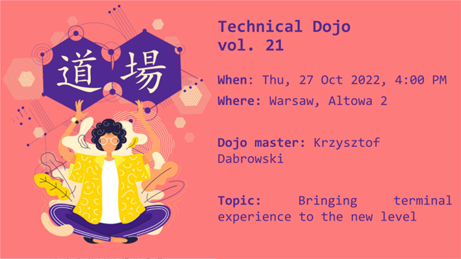

# Technical Dojo - Bringing terminal experience to the new level

Content for my lecture at an internal Predica workshop called Technical Dojo.



If you are going through the materials after the dojo I highly encourage you to check out [A nice tutorial [by Microsoft](https://learn.microsoft.com/en-us/windows/terminal/tutorials/custom-prompt-setup) from [Useful links](#useful-links). It's probably of higher quality than my guide :D

## Follow allonge guide

My goal for this workshop is that the attendees would walk out with a more pleasing and joyful terminal configuration.

This guide will walk you through basic terminal customizations shown at the talk and link to other useful materials that you can explore on your own.  
You can follow this guide with me during the meeting or at your paste later :)

## 1. Windows Terminal

A modern terminal application with multiple useful features developed by Microsoft.

[Install link](https://apps.microsoft.com/store/detail/windows-terminal/9N0DX20HK701)

## 2. Winget

A package manager for Windows from Microsoft. It comes by default with Windows 11 and with later versions of Windows 10

[Winget install link](https://apps.microsoft.com/store/detail/instalator-aplikacji/9NBLGGH4NNS1)

[winget.run - Site to search for all winget packages](https://winget.run/)

## 3. Editing PowerShell profile

Some commands used today need to be run every time a new PowerShell session is started. To do this automatically we need to put them in our profile script.

Open the profile with your favorite editor from terminal

```ps1
code $PROFILE
```

Or just output the file location and open it manually with `echo $PROFILE`

In case you get the following error

`File C:\Users\<USER_NAME>\Documents\PowerShell\Microsoft.PowerShell_profile.ps1 cannot be loaded. The file <FILE_NAME> is not digitally signed.`

You need to enable the execution of locally created scripts. This can be done by running `Set-ExecutionPolicy -Scope CurrentUser RemoteSigned`

## 3.1 Context History

By default pressing the up arrow will bring the previous command to the terminal. This is fine but a lot better experience can be achieved by **adding the following lines to the profile**

```ps1
Set-PSReadLineKeyHandler -Key UpArrow -Function HistorySearchBackward
Set-PSReadLineKeyHandler -Key DownArrow -Function HistorySearchForward
Set-PSReadLineKeyHandler -Key Tab -Function Complete
```

## 4. Nerd Fonts

Go to the [Nerd Fonts project page](https://www.nerdfonts.com/) and download and install one of the fonts.

If you don't have a favorite one Caskaydia Cove Nerd or FiraCode Nerd Font will serve you well.

Then you need to extract the fonts, select all of them, right click and select install.

One last step to using the font is changing the Windows Terminal settings to the preferred font.

## 5. Oh My Posh

[Project page](https://ohmyposh.dev/docs/installation/windows)

Install command

`winget install JanDeDobbeleer.OhMyPosh -s winget`

Initialize oh my posh by placing the following line **in your PowerShell Profile**

`oh-my-posh init pwsh  | Invoke-Expression`

You can view [preinstalled themes](https://ohmyposh.dev/docs/themes) in the context of the current directory by running `Get-PoshThemes` from PowerShell.

Once you decide on which to pick as your own you can set it as the theme by changing the Posh init command **in your PowerShell Profile** and replacing _<THEME_NAME>_ withe the name of the chosen theme:

```ps1
oh-my-posh init pwsh --config "$env:POSH_THEMES_PATH/<THEME_NAME>.omp.json" | Invoke-Expression
```

e.g.

```ps1
oh-my-posh init pwsh --config "$env:POSH_THEMES_PATH/jandedobbeleer.omp.json" | Invoke-Expression
```

The commands you place in the PowerShell Profile can be run directly in the terminal but if not placed in the Profile they won't affect new sessions.

If you would like to customize the prompt on your own the current theme can be extracted to a local file with the `oh-my-posh config export --output ./<NAME>.omp.json` command.

---------------------------

## Useful links

Other cool terminals besides Windows Terminal

- [Hyper](https://hyper.is/)
- [Tabby](https://tabby.sh/)
- [List of many others](https://windowsreport.com/best-windows-11-terminal/)

[A nice tutorial by Microsoft](https://learn.microsoft.com/en-us/windows/terminal/tutorials/custom-prompt-setup)

[Detailed customization guide for Windows Terminal](https://freshman.tech/windows-terminal-guide/#launching-the-terminal-with-a-keyboard-shortcut)

[Live preview of Windows Terminal Themes](https://windowsterminalthemes.dev/)

[Chocolatey (an alternative to winget)](https://chocolatey.org/)

[Starship prompt (an alternative to Oh My Posh)](https://starship.rs/)